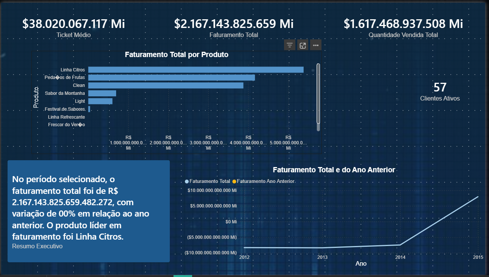
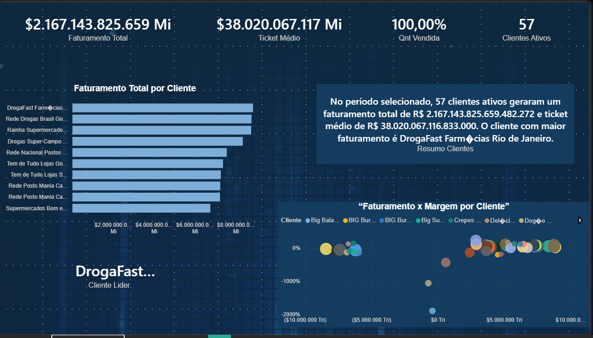
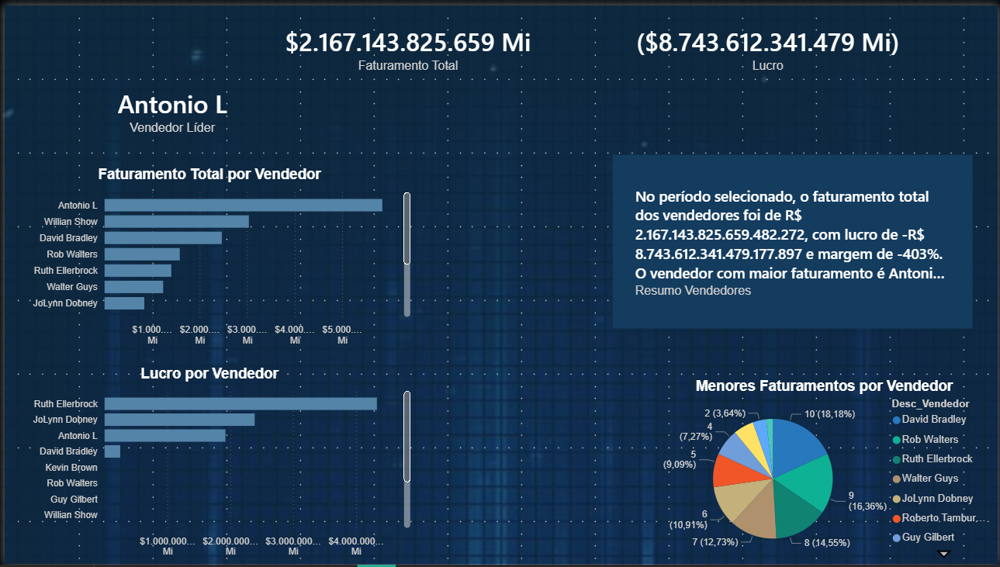

# Dashboard Financeiro – Power BI (Modelo Estrela)

Este repositório contém um projeto de Power BI desenvolvido com foco em análise de **faturamento, custos, clientes e desempenho de vendedores**, utilizando **modelo estrela** e boas práticas de DAX.  
O objetivo principal é uso em **portfólio** e **entrevistas**, demonstrando domínio de modelagem de dados, criação de medidas e storytelling com dashboards.

---

## Estrutura do Repositório

- `dashboard_presidencia.pbix`  
  Arquivo principal do Power BI com o modelo de dados, medidas DAX e dashboards.

- Pasta `img/`  
  Contém capturas de tela das páginas do relatório:
  - `img/pagina1_overview.png` – Página 1: Visão Geral
  - `img/pagina2_clientes.png` – Página 2: Análise de Clientes
  - `img/pagina3_vendedores.png` – Página 3: Análise de Vendedores

---

## Visualização das Páginas (Screenshots)

### Página 1 – Visão Geral



---

### Página 2 – Análise de Clientes



---

### Página 3 – Análise de Vendedores



---

## Modelagem de Dados

O modelo foi construído em **estrela**, com uma tabela fato central e múltiplas dimensões relacionadas.

### Tabela Fato

**`fato_presidencia`**

Principais colunas:
- `Faturamento`
- `Custo_Fixo`
- `Custo_Variavel`
- `Custo_Frete`
- `Quantidade_Vendida`
- `ID_Cliente`
- `ID_Produto`
- `ID_Fabrica`
- `ID_Vendedor`
- `ID_Tempo`

### Tabelas Dimensão

- **`dim_cliente`**
  - `ID_Cliente`
  - Nome do cliente, segmento, região etc. (quando disponível)

- **`dim_produto`**
  - `ID_Produto`
  - Nome do produto, categoria, linha etc.

- **`dim_fabrica`**
  - `ID_Fabrica`
  - Descrição da fábrica / unidade

- **`dim_organizacional`**
  - `ID_Vendedor`
  - Nome do vendedor, região, equipe etc.

- **`dim_tempo`**
  - `ID_Tempo`
  - `Data`, `Mês`, `Ano`, `Trimestre`, colunas derivadas de calendário

### Relacionamentos

- Todas as dimensões se relacionam com a fato via relacionamentos **1:N**
- Direção de filtro: **single direction** da dimensão para a fato
- Modelo em estrela validado para análise

---

## Boas Práticas Utilizadas

- Modelo estrela com separação clara entre **fato** e **dimensões**
- Tabela exclusiva para **medidas DAX** (`Medidas Financeiras`)
- Uso de **medidas**, e não colunas calculadas, para métricas de negócio
- Nomenclatura padronizada para medidas:
  - `Faturamento Total`, `Custo Total`, `Lucro`, `Margem %`, `Ticket Médio`, etc.
- Uso de funções de tempo (Time Intelligence):
  - `TOTALYTD`, `SAMEPERIODLASTYEAR`, `Crescimento %` ano contra ano
- Medidas de **ranking** (Top N e piores), **participação no total** (%) e **medidas de texto**, usadas em cartões de resumo executivo

---

## Principais Medidas DAX

Abaixo, alguns exemplos principais (não é a lista completa):

```DAX
-- Receita
Faturamento Total =
SUM ( fato_presidencia[Faturamento] )

-- Custos
Custo Fixo Total =
SUM ( fato_presidencia[Custo_Fixo] )

Custo Variável Total =
SUM ( fato_presidencia[Custo_Variavel] )

Custo Frete Total =
SUM ( fato_presidencia[Custo_Frete] )

Custo Total =
[ Custo Fixo Total ]
    + [ Custo Variável Total ]
    + [ Custo Frete Total ]

-- Lucro e Margem
Lucro =
[ Faturamento Total ] - [ Custo Total ]

Margem % =
DIVIDE ( [Lucro], [Faturamento Total] )

-- Quantidade e Ticket
Quantidade Vendida Total =
SUM ( fato_presidencia[Quantidade_Vendida] )

Clientes Ativos =
DISTINCTCOUNT ( fato_presidencia[ID_Cliente] )

Ticket Médio =
DIVIDE ( [Faturamento Total], [Quantidade Vendida Total] )

-- Ano Anterior e Crescimento
Faturamento Ano Anterior =
CALCULATE (
    [Faturamento Total],
    SAMEPERIODLASTYEAR ( dim_tempo[Data] )
)

Crescimento Faturamento % =
VAR vAtual    = [Faturamento Total]
VAR vAnterior = [Faturamento Ano Anterior]
RETURN
    DIVIDE ( vAtual - vAnterior, vAnterior )

-- Exemplo de líder (Vendedor Líder)
Vendedor Líder =
VAR TabelaVend =
    SUMMARIZE (
        VALUES ( dim_organizacional[Desc_Vendedor] ),
        dim_organizacional[Desc_Vendedor],
        "Fat", [Faturamento Total]
    )
VAR TopLinha =
    TOPN ( 1, TabelaVend, [Fat], DESC )
RETURN
    MAXX ( TopLinha, dim_organizacional[Desc_Vendedor] )
```

Além disso, o projeto inclui medidas de:

- **Rank de clientes e vendedores** (por faturamento, lucro e margem)
- **Participação no faturamento total** por cliente, vendedor, fábrica e região
- **Medidas de texto** para resumos executivos por página (overview, clientes, vendedores)

---

## Perguntas de Negócio Respondidas e Insights

O dashboard foi construído em cima de perguntas de negócio claras. Abaixo, um resumo das principais questões e de como cada página responde a elas.

---

### 1. Quais produtos geram maior faturamento?

**Onde:** Página 1 – Visão Geral  

**Como é respondida:**
- Gráfico de barras horizontais com **Top 10 produtos por Faturamento Total**
- Filtros por período, região, vendedor, fábrica etc.

**Insight:**  
Permite identificar rapidamente os produtos que concentram a maior parte da receita, ajudando a priorizar estratégias comerciais, marketing e políticas de preço.

---

### 2. Como as vendas evoluem ao longo do tempo?

**Onde:** Página 1 – Visão Geral  

**Como é respondida:**
- Gráfico de linhas com **Faturamento Total por mês**
- Linha opcional de **Faturamento Ano Anterior** para comparação
- Uso de medidas de tempo (YTD, ano anterior, crescimento %)

**Insight:**  
Mostra tendência de vendas, sazonalidade, crescimento ou queda ao longo dos meses e anos. Facilita a avaliação de períodos de alta e baixa e o impacto de campanhas ou eventos específicos.

---

### 3. Quais fábricas e regiões apresentam melhor desempenho?  
*(aplicável na análise geral da Página 1, quando esses visuais estiverem ativos)*

**Onde:** Página 1 – Visão Geral  

**Como é respondida:**
- Gráficos de barras/colunas com:
  - **Faturamento por Fábrica**
  - **Faturamento por Região** (a partir de `dim_organizacional`)

**Insight:**  
Permite comparar unidades/fábricas e regiões em termos de faturamento, destacando quais locais puxam o resultado e onde pode haver oportunidade de melhoria ou necessidade de intervenção.

---

### 4. Quem são os principais clientes da empresa?

**Onde:** Página 2 – Análise de Clientes  

**Como é respondida:**
- Gráfico **Top 10 Clientes por Faturamento**
- Tabela detalhada com:
  - Faturamento Total  
  - Quantidade vendida  
  - Lucro  
  - Margem %  
  - Ticket Médio  
  - Participação no faturamento total  

**Insight:**  
Mostra os clientes que geram mais receita, a concentração de faturamento em poucos clientes e a relevância de cada um para o resultado geral, apoiando decisões de relacionamento, retenção e priorização.

---

### 5. Quais clientes são mais (ou menos) rentáveis?

**Onde:** Página 2 – Análise de Clientes  

**Como é respondida:**
- Gráfico **Top 10 Clientes por Margem %**
- Gráfico de dispersão **Faturamento x Margem % por Cliente**
- Tabela com **Lucro** e **Margem %** por cliente

**Insight:**  
Ajuda a identificar clientes com alto faturamento, porém baixa margem, e clientes com menor volume, mas alta lucrabilidade. Esse tipo de análise é importante para ajustar políticas comerciais, descontos e foco de atendimento.

---

### 6. Como está o desempenho dos vendedores?

**Onde:** Página 3 – Análise de Vendedores  

**Como é respondida:**
- Gráficos:
  - **Faturamento por Vendedor**
  - **Top 10 Vendedores por Lucro**
  - **Piores Vendedores por Margem %**
- Card com **Vendedor Líder**
- Resumo em texto (medidas DAX) comentando o desempenho geral

**Insight:**  
Permite enxergar quais vendedores geram mais receita, quais realmente trazem lucro e quais estão vendendo com margens muito baixas. Apoia decisões de gestão comercial, metas, treinamento e acompanhamento de performance.

---

### 7. Quais são os indicadores gerais de desempenho financeiro?

**Onde:** Todas as páginas (principalmente Página 1 – Visão Geral)  

**Como é respondida:**
- Conjunto de KPIs em cartões:
  - Faturamento Total  
  - Custo Total  
  - Lucro  
  - Margem %  
  - Crescimento de Faturamento %  
  - Ticket Médio  
  - Clientes Ativos (na página de clientes)  
  - Indicadores focados em vendedores (na página de vendedores)

**Insight:**  
Resumo executivo para gestores, permitindo em poucos segundos entender o nível de faturamento, custos, lucratividade, eficiência e crescimento do negócio no período filtrado.

---

## Estrutura dos Dashboards

### Página 1 – Visão Geral (Overview)

- Foco em visão macro de faturamento, custos, lucro e margem  
- KPIs em destaque no topo  
- Gráficos de:
  - Faturamento ao longo do tempo  
  - Top produtos  
  - Fábricas e regiões (quando aplicados)  
- Cartão de **resumo executivo em texto (DAX)** explicando o contexto filtrado

---

### Página 2 – Análise de Clientes

- Foco em concentração de receita e rentabilidade por cliente  
- KPIs: faturamento, clientes ativos, ticket médio, lucro  
- Gráficos:
  - Top 10 clientes por faturamento  
  - Top 10 clientes por margem %  
  - Dispersão faturamento x margem  
- Tabela detalhada por cliente  
- Cartão de **resumo executivo de clientes**

---

### Página 3 – Análise de Vendedores

- Foco em performance de vendedores  
- KPIs: faturamento, lucro, margem, vendedor líder  
- Gráficos:
  - Faturamento por vendedor  
  - Top 10 vendedores por lucro  
  - Piores vendedores por margem %  
- Cartão de **resumo executivo de vendedores**

---

## Como Abrir e Explorar

1. Instale o **Power BI Desktop** (versão mais recente).  
2. Faça download ou clone este repositório.  
3. Abra o arquivo `dashboard_presidencia.pbix`.  
4. Navegue entre as páginas:
   - `Visão Geral`
   - `Clientes`
   - `Vendedores`
5. Use as segmentações (**Ano, Mês, Cliente, Produto, Vendedor, Região, Fábrica**) para explorar cenários diferentes.

---

## Objetivo de Portfólio

Este projeto foi construído para demonstrar:

- Modelagem em **modelo estrela**  
- Criação de **medidas DAX** profissionais  
- Organização de medidas em **tabela dedicada**  
- Construção de dashboards com **storytelling**, incluindo:
  - Overview executivo  
  - Profundidade em Clientes  
  - Profundidade em Vendedores  
- Uso de **resumos dinâmicos em texto** para explicar insights diretamente no relatório
